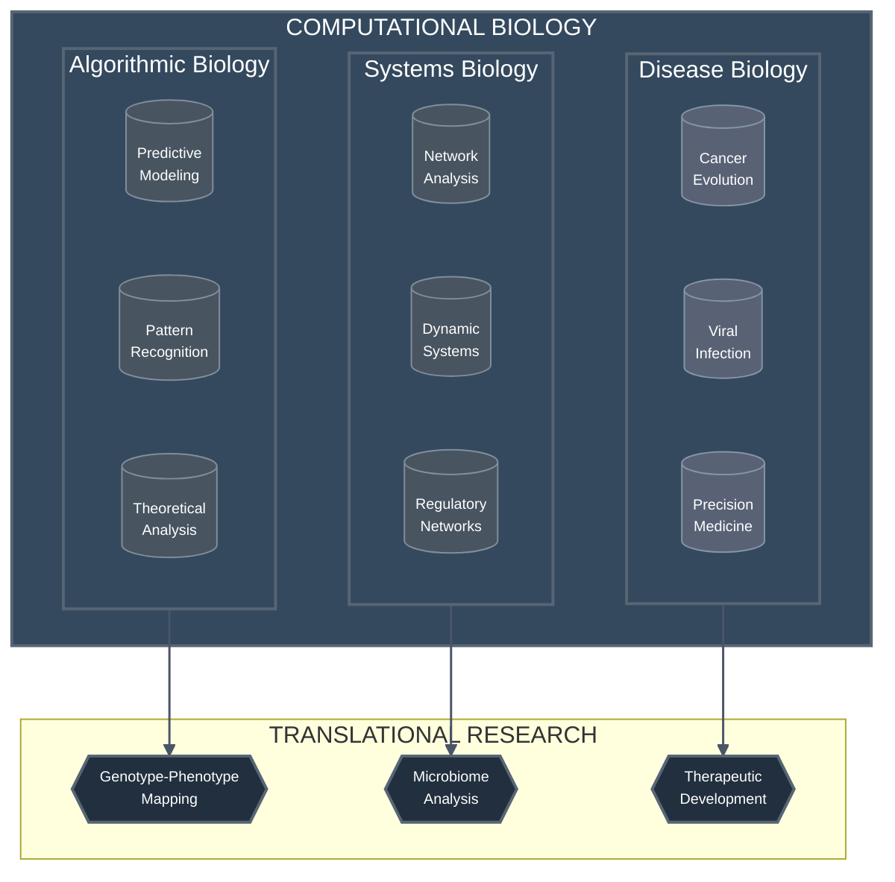
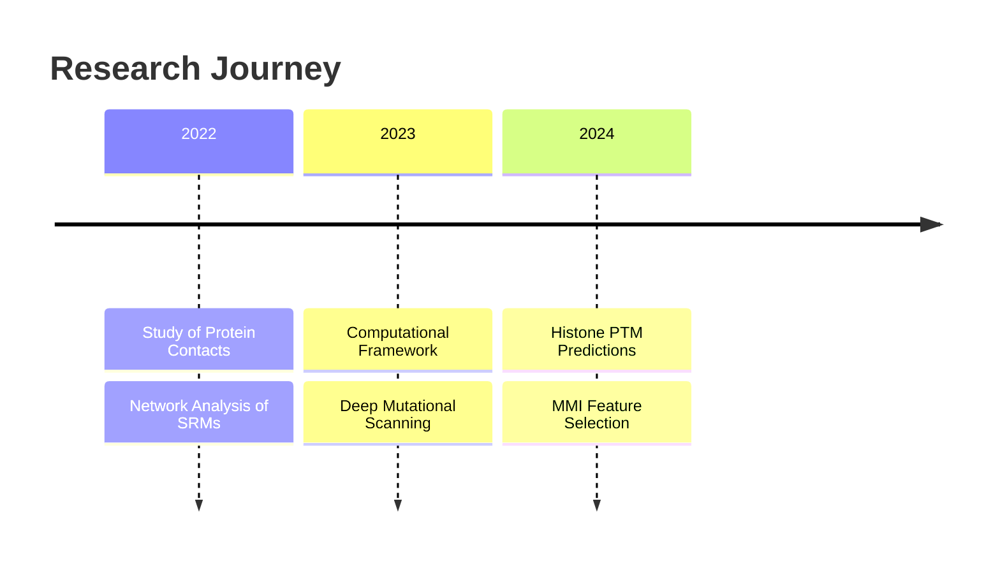
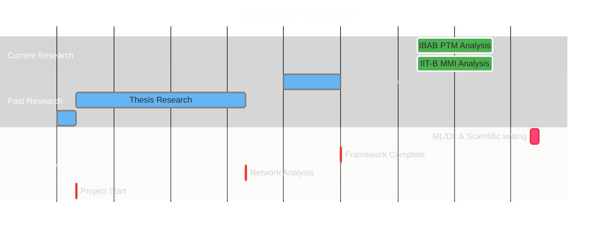

<div align="center">
  
  
  [](https://git.io/typing-svg)

  <a href="https://drive.google.com/file/d/1udogJnLogZG3-_tfQpZjgN1DnbuN6n0H/view?usp=sharing">
    
  </a>
</div>

### 🧬 About Me

```python
class ComputationalBiologist:
    def __init__(self):
        self.name = "Dhanasekhar V.K."
        self.role = "Computational Biology Explorer"
        self.location = "India 🇮🇳"
        self.education = {
            "degree": "BS-MS dual degree, Majors in Biology & Minors in Data Science, IISER Mohali"
        }
    
    def mission(self):
        return "Bridging the gap between computation, mathematics and biology 🧬"

me = ComputationalBiologist()
```
### 🧬 Research Focus Areas


<!-- ### 🔬 Research Interests

<!-- - 🧬 **Genomics & NGS Analysis**: DNA/RNA-seq data processing and variant calling -->
<!-- - 🤖 **Machine Learning in Biology**: Deep learning for protein structure prediction
- 📊 **Biostatistics**: Statistical analysis of biological data
- 🦠 **Systems Biology**: Modeling biological networks and pathways  hah --> 

---
### 📈 GitHub Statistics
<div align="center">
  
</div>
<br>

<div align="center">
  <!-- GitHub Stats Card with Ring Theme -->
  
  &nbsp;&nbsp;
  <!-- GitHub Streak Stats -->
  
</div>
<br>
<!-- Language Stats with Ring Theme -->
<div align="center">
  
</div>

### 💻 Tech Stack

<div align="center">
  <h4>🧬 Computational Biology & Bioinformatics</h4>
  
  
  
  
  
  <h4>💻 Programming & Computing</h4>
  
  
  
  
  
  
  <h4>🤖 ML & Data Science</h4>
  
  
  
  
  
  
  <h4>🛠️ Development Tools</h4>
  
  
  
  
  
  
  
  <h4>📝 Scientific Tools</h4>
  
  
  
</div>

### 🔬 Current Focus
```python
current_projects = {
    "main": "Histone PTM Predictions",
    "collaboration": "MMI Feature Selection with IIT Bombay",
    "learning": "ML and Information theory",
    "timeline": "Feb 2024 - Present"
}
```

### 📊 Research Impact & Metrics



### 🎯 Key Research Metrics
<div align="center">
<table>
  <tr>
    <th>Research Area</th>
    <th>Impact Metrics</th>
    <th>Technologies</th>
  </tr>
  <tr>
    <td>Protein Structure Analysis</td>
    <td>
      • Analyzed 3,600+ protein pairs<br>
      • 2,004 Deep Mutational Scans<br>
      • Single Domain Protein Study
    </td>
    <td>Network Science, Graph Theory</td>
  </tr>
  <tr>
    <td>Histone PTM Research</td>
    <td>
      • MMI-based Feature Selection<br>
      • Graph Entropy Clustering<br>
      • Neural Network Models
    </td>
    <td>ML/DL, Graph Algorithms</td>
  </tr>
  <tr>
    <td>Web Framework</td>
    <td>
      • Protein Visualization Tool<br>
      • Contact Network Analysis<br>
      • UniProt Integration
    </td>
    <td>Web Development</td>
  </tr>
</table>
</div>

<!-- ### 📈 Research Statistics

<div align="center">
  
  
  
</div> -->

### 🔬 Research Timeline



### 🎓 Research Collaborations

<div align="center">

| Institution | Collaborator | Research Focus |
|-------------|--------------|----------------|
| IBAB & IIT Bombay | Dr. Nithya Ramakrishnan & Dr. Sibi Raj B Pillai | Histone PTMs & MMI Analysis |
| IISER Mohali & Kolkata | Dr. Shashi Bhushan Pandit & Prof. Somdatta Sinha | Protein Networks & Phenotypic Effects |

</div>

### 🤝 Let's Connect!

<div align="center">
  <h3>"Debugging the Code of Life, One Gene at a Time" 🧬</h3>
  
  <a href="https://instagram.com/pho_dhanaskarvk_7"></a>
  <a href="mailto:dhanasekharvk@gmail.com"></a>
  <a href="https://in.linkedin.com/in/dhanasekhar-v-k-975b31253"></a>
</div>
