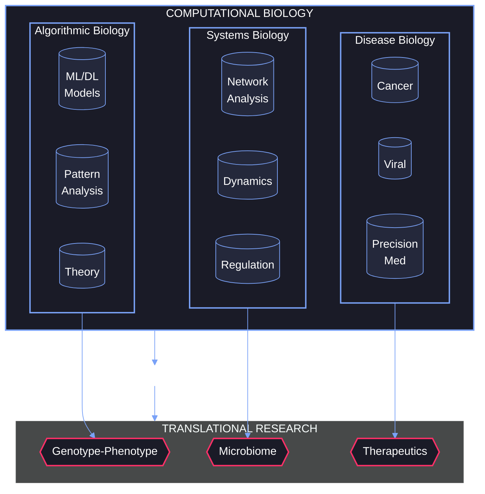
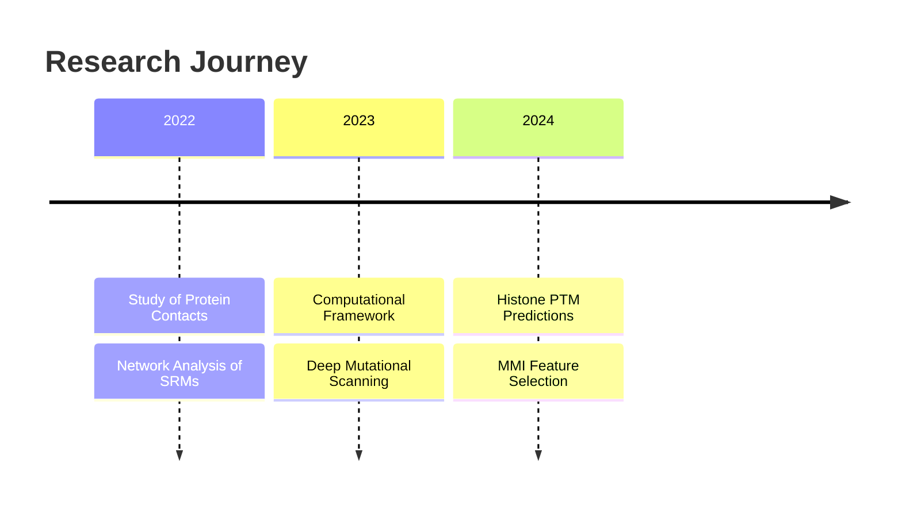
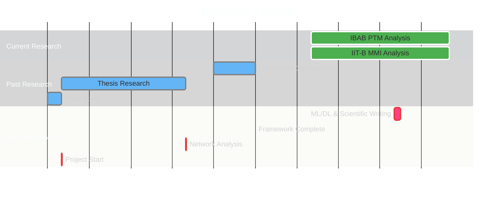

<div align="center">
  
  
  [](https://git.io/typing-svg)

  <a href="https://drive.google.com/file/d/1udogJnLogZG3-_tfQpZjgN1DnbuN6n0H/view?usp=sharing">
    
  </a>
</div>

---

### 🧪 Who’s This Bio-Coding Maverick?

```python
class BioCodeAlchemist:
    def __init__(self):
        self.name = "Dhanasekhar V.K."
        self.alias = "The Helix Hacker"
        self.base = "India 🇮🇳"
        self.training = {
            "quest": "BS-MS Dual Degree",
            "realms": ["Biology", "Data Science"],
            "fortress": "IISER Mohali"
        }
        self.arsenal = ["Python", "TensorFlow", "Graph Theory", "PCR Magic"]
        self.vision = "To fuse code, math, and biology into a symphony of discovery 🎶"

    def battle_cry(self):
        return f"I’m {self.name}, aka {self.alias}, hacking life’s deepest secrets from {self.base}!"

me = BioCodeAlchemist()
print(me.battle_cry())
print(f"Mission: {me.vision}")

```
##### The Origin Story

Picture this: a kid with a microscope in one hand and a laptop in the other, dreaming of decoding the universe one base pair at a time. That’s me. I started in the wet lab, mesmerized by DNA’s dance, but then I met Python—and suddenly, biology wasn’t just a science; it was a galaxy of possibilities. Now, I’m a bridge-builder—spanning wet lab benches and GPU clusters, chasing breakthroughs with a pipette and a keyboard. My fuel? Curiosity. My spark? The moment data whispers a secret no one’s heard before.

---

#### 🧬 Research Galaxy: Where I Orbit

Here’s a snapshot of my research domains and their real-world applications:


<!-- ### 🔬 Research Interests

<!-- - 🧬 **Genomics & NGS Analysis**: DNA/RNA-seq data processing and variant calling -->
<!-- - 🤖 **Machine Learning in Biology**: Deep learning for protein structure prediction
- 📊 **Biostatistics**: Statistical analysis of biological data
- 🦠 **Systems Biology**: Modeling biological networks and pathways  hah --> 

---
### 📈 GitHub Statistics

I’m a dedicated contributor to computational biology projects. Here’s my GitHub story:

<div align="center">  <br><br>      <br><br>  </div>
Beam up to my GitHub and explore the code fueling my bio-odyssey!

--- 
### 🛸 Tech Arsenal
The gadgets and gizmos powering my interstellar research:

🧬 Bio-Galactic Tools
   

💾 Code Cannons
   

🤖 AI Accelerators
   

🧪 Lab-to-Laptop Bridge
  

📐 Math Matrix
  

Charging Up: Mastering Python, TensorFlow, and wet-dry lab fusion for a bio-revolution.

### 🔬 Current Focus
Here’s what I’m diving into right now:
```python
current_projects = {
    "main": "Histone PTM Predictions",
    "collaboration": "MMI Feature Selection with IIT Bombay",
    "learning": "ML and Information theory",
    "timeline": "Feb 2024 - Present"
}
```

### 📊 Research Impact & Metrics
My work is making waves in computational biology:



### 🎯 Key Research Metrics
<div align="center"> <table> <tr> <th>Research Area</th> <th>Impact Metrics</th> <th>Technologies</th> </tr> <tr> <td>🧬 Protein Structure Analysis</td> <td> • Analyzed 3,600+ protein pairs<br> • 2,004 Deep Mutational Scans<br> • Single Domain Protein Study </td> <td>Network Science, Graph Theory</td> </tr> <tr> <td>🔬 Histone PTM Research</td> <td> • MMI-based Feature Selection<br> • Graph Entropy Clustering<br> • Neural Network Models </td> <td>ML/DL, Graph Algorithms</td> </tr> <tr> <td>💻 Web Framework</td> <td> • Protein Visualization Tool<br> • Contact Network Analysis<br> • UniProt Integration </td> <td>Web Development</td> </tr> </table> </div>

<!-- ### 📈 Research Statistics

<div align="center">
  
  
  
</div> -->

### 🔬 Research Timeline
A visual roadmap of my scientific adventures:



### 🌐 Alliance Network
My crew of co-explorers across the bio-verse:

<div align="center"> <table style="background: #0D1117; border: 2px solid #FF007A; border-radius: 10px;"> <tr style="background: #1a1c2c;"> <th>Base</th> <th>Allies</th> <th>Mission</th> <th>Beacon</th> </tr> <tr> <td>IBAB & IIT Bombay</td> <td>Dr. Nithya R. & Dr. Sibi Raj B. P.</td> <td>PTM & MMI Signal Hunt</td> <td><a href="">Transmitting</a></td> </tr> <tr> <td>IISER Mohali & Kolkata</td> <td>Dr. Shashi B. P. & Prof. Somdatta S.</td> <td>Protein Nets & Phenotype Waves</td> <td><a href="https://drive.google.com/file/d/1t6SLEwe4P7vpB5SM4vIGjK8HmIwv7yjQ/view?usp=sharing">Star Chart</a></td> </tr> </table> </div>
Alliance Power: These partnerships are fusion reactors—igniting ideas that reshape biology’s frontier.

### 📡 Intergalactic Comms

<div align="center"> <h3>"Hacking the Helix, One Cosmic Bit at a Time" 🧬</h3>  <p>Bio-nerds, code cosmonauts, or dreamers of the unknown—let’s connect! I’m here to swap lab tales, brainstorm bio-hacks, or plot the next galactic discovery. Drop a signal and let’s make science fiction reality.</p> <a href="https://instagram.com/pho_dhanaskarvk_7"></a> <a href="mailto:dhanasekharvk@gmail.com"></a> <a href="https://in.linkedin.com/in/dhanasekhar-v-k-975b31253"></a> <a href="https://your-blog-or-website.com"></a> </div>
