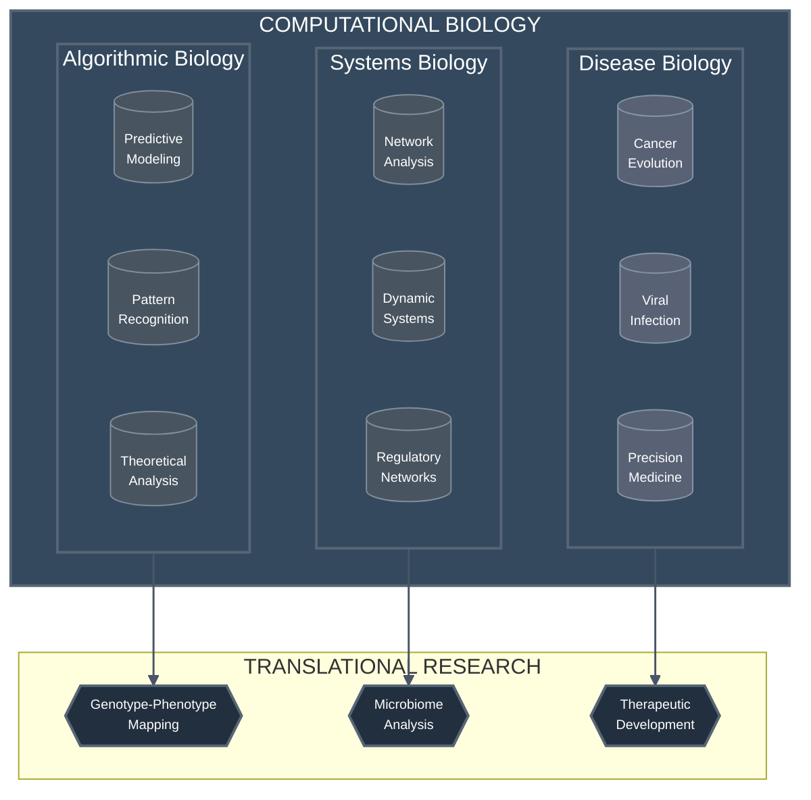
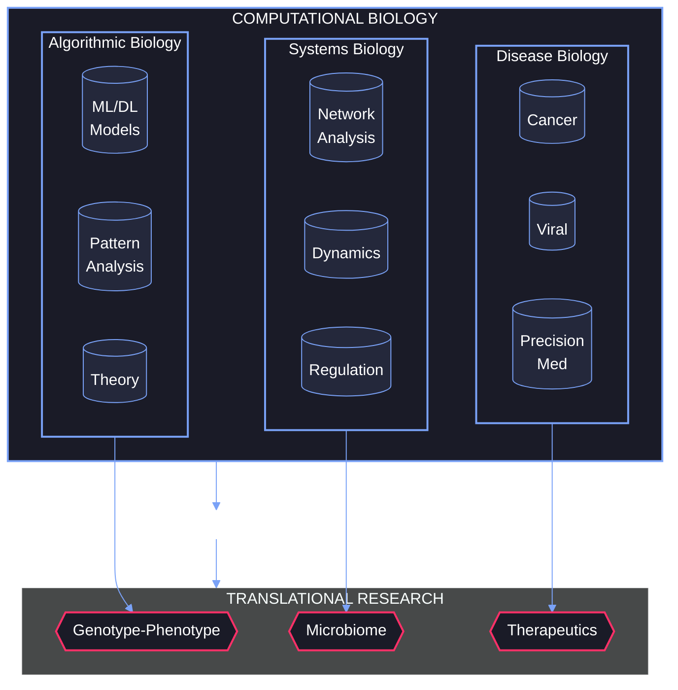

```mermaid
graph TB
    %% Core Research Domains
    subgraph CORE["COMPUTATIONAL BIOLOGY"]
        direction TB
        subgraph ALG["Algorithmic Biology"]
            A1[("Predictive<br/>Modeling")]:::small
            A2[("Pattern<br/>Recognition")]:::small
            A3[("Theoretical<br/>Analysis")]:::small
        end
        
        subgraph SYS["Systems Biology"]
            S1[("Network<br/>Analysis")]:::small
            S2[("Dynamic<br/>Systems")]:::small
            S3[("Regulatory<br/>Networks")]:::small
        end
        
        subgraph DIS["Disease Biology"]
            D1[("Cancer<br/>Evolution")]:::small
            D2[("Viral<br/>Infection")]:::small
            D3[("Precision<br/>Medicine")]:::small
        end
    end

    subgraph APPS[" TRANSLATIONAL  RESEARCH"]
        T1{{"Genotype-Phenotype<br/>Mapping"}}:::small
        T2{{"Microbiome<br/>Analysis"}}:::small
        T3{{"Therapeutic<br/>Development"}}:::small
    end

    ALG --> T1
    SYS --> T2
    DIS --> T3

    %% Scientific journal color scheme
    classDef default fill:#2a3541,stroke:#4a5568,stroke-width:1px,color:#fff
    classDef core fill:#34495e,stroke:#576574,stroke-width:2px,color:#fff
    classDef system fill:#485460,stroke:#808e9b,stroke-width:1px,color:#fff
    classDef disease fill:#596275,stroke:#8395a7,stroke-width:1px,color:#fff
    classDef apps fill:#222f3e,stroke:#576574,stroke-width:2px,color:#fff
    classDef small font-size:10px,width:100px,height:40px

    class CORE,ALG,SYS,DIS core
    class A1,A2,A3 system
    class S1,S2,S3 system
    class D1,D2,D3 disease
    class T1,T2,T3 apps

    linkStyle default stroke:#4a5568,stroke-width:1.5px
```

### 🧬 Research Focus Areas

```mermaid
%%{init: {'theme': 'dark', 'themeVariables': { 'fontSize': '16px' }}}%%
graph TB
    %% Core Research Areas
    subgraph CORE["COMPUTATIONAL BIOLOGY"]
        direction TB
        subgraph ALG["Algorithmic Biology"]
            A1[("ML/DL<br/>Models")]:::small
            A2[("Pattern<br/>Analysis")]:::small
            A3[("Theory")]:::small
        end
        
        subgraph SYS["Systems Biology"]
            S1[("Network<br/>Analysis")]:::small
            S2[("Dynamics")]:::small
            S3[("Regulation")]:::small
        end
        
        subgraph DIS["Disease Biology"]
            D1[("Cancer")]:::small
            D2[("Viral")]:::small
            D3[("Precision<br/>Med")]:::small
        end
    end

    space[" "]:::space
    
    subgraph APPS["TRANSLATIONAL RESEARCH"]
        T1{{"Genotype-Phenotype"}}:::apps
        T2{{"Microbiome"}}:::apps
        T3{{"Therapeutics"}}:::apps
    end

    %% Connections with better spacing
    CORE --> space
    space --> APPS
    ALG --> T1
    SYS --> T2
    DIS --> T3

    %% Optimized color scheme
    classDef default fill:#1a1b27,stroke:#7aa2f7,stroke-width:1px,color:#fff
    classDef core fill:#1a1b27,stroke:#7aa2f7,stroke-width:2px,color:#fff
    classDef small fill:#24283b,stroke:#7aa2f7,stroke-width:1px,color:#fff
    classDef apps fill:#1a1b27,stroke:#ff3068,stroke-width:2px,color:#fff
    classDef space fill:none,stroke:none

    class CORE,ALG,SYS,DIS core
    class A1,A2,A3,S1,S2,S3,D1,D2,D3 small
    class T1,T2,T3 apps
    class space space

    linkStyle default stroke:#7aa2f7,stroke-width:1px
```