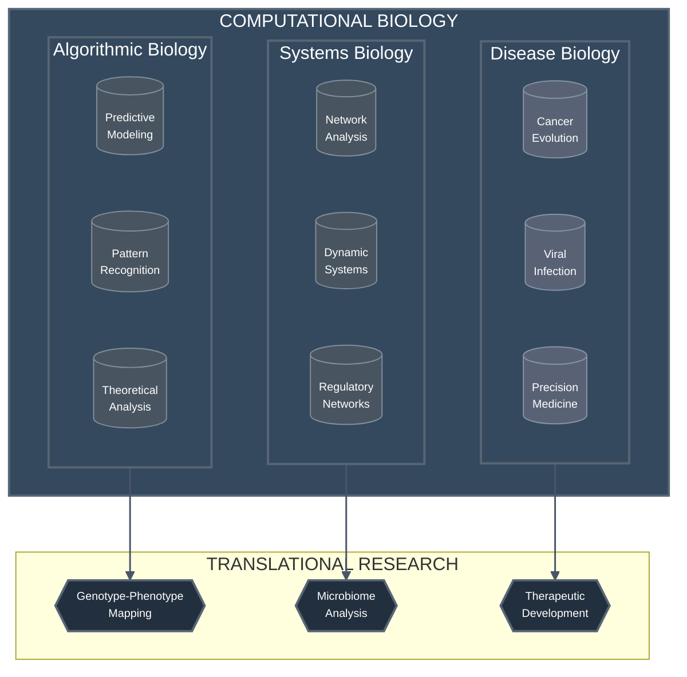
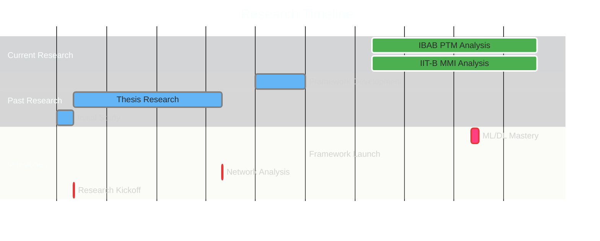

<div align="center">
  
  
  [](https://git.io/typing-svg)

  <a href="https://drive.google.com/file/d/1udogJnLogZG3-_tfQpZjgN1DnbuN6n0H/view?usp=sharing">
    
  </a>
</div>

I’m an active contributor to computational biology projects. Here’s a glimpse of my GitHub journey:

🏆 Quickdraw Trophy: For lightning-fast pull request reviews.
📊 Contributions: Over 10 repositories in the past year.
🔥 Streak: 30+ days of consistent coding.
<div align="center">  <br><br>      <br><br>  </div>
Explore my GitHub for more!

---

## 🧬 About Me

```python
class ComputationalBiologist:
    def __init__(self):
        self.name = "Dhanasekhar V.K."
        self.role = "Computational Biology Explorer"
        self.location = "India 🇮🇳"
        self.education = {
            "degree": "BS-MS Dual Degree",
            "majors": "Biology",
            "minors": "Data Science",
            "institute": "IISER Mohali"
        }
        self.passions = ["Decoding biological complexity", "Building computational tools", "Collaborating across disciplines"]

    def mission(self):
        return "Bridging computation, mathematics, and biology to solve real-world problems 🧬"

me = ComputationalBiologist()
print(f"Hi, I’m {me.name}, a {me.role} from {me.location}. {me.mission()}")

```
I’m passionate about unraveling the mysteries of life through code, blending biology with machine learning and mathematics to create impactful tools and insights.

#### 🔬 Research Focus Areas



#### 📈 GitHub Statistics
I’m an active contributor to computational biology projects. Here’s a glimpse of my GitHub journey:

🏆 Quickdraw Trophy: For lightning-fast pull request reviews.
📊 Contributions: Over 10 repositories in the past year.
🔥 Streak: 30+ days of consistent coding.
<div align="center">  <br><br>      <br><br>  </div>
Explore my GitHub for more!

💻 Tech Stack
Here’s the toolkit powering my research and projects:

🧬 Computational Biology & Bioinformatics
    

💻 Programming & Computing
    

🤖 ML & Data Science
    

🛠️ Development Tools
     

📝 Scientific Tools
  

Currently mastering: Python, TensorFlow, PyTorch, Network Science, and Information Theory for my work on Histone PTMs and MMI Feature Selection.

🔬 Current Focus
Here’s what I’m diving into right now:

Histone PTM Predictions: Building ML models to predict post-translational modifications in histones, unlocking secrets of epigenetic regulation.
MMI Feature Selection: Partnering with IIT Bombay to enhance biological datasets using Mutual Information-based feature selection.
Learning: Deepening my expertise in ML and Information Theory for biological applications.
Timeline: February 2024 - Present

📊 Research Impact & Metrics
My work is making waves in computational biology:

<div align="center"> <table> <tr> <th>Research Area</th> <th>Impact Metrics</th> <th>Technologies</th> </tr> <tr> <td>🧬 Protein Structure Analysis</td> <td> • Analyzed 3,600+ protein pairs<br> • 2,004 Deep Mutational Scans<br> • Single Domain Protein Study </td> <td>Network Science, Graph Theory</td> </tr> <tr> <td>🔬 Histone PTM Research</td> <td> • MMI-based Feature Selection<br> • Graph Entropy Clustering<br> • Neural Network Models </td> <td>ML/DL, Graph Algorithms</td> </tr> <tr> <td>💻 Web Framework</td> <td> • Protein Visualization Tool<br> • Contact Network Analysis<br> • UniProt Integration </td> <td>Web Development</td> </tr> </table> </div>

### ⏳ Research Timeline
Here’s a visual journey of my research milestones:


🎓 Research Collaborations
I’m proud to work with brilliant minds across institutions:

<div align="center"> <table> <tr> <th>Institution</th> <th>Collaborator</th> <th>Research Focus</th> <th>Link</th> </tr> <tr> <td>IBAB & IIT Bombay</td> <td>Dr. Nithya Ramakrishnan & Dr. Sibi Raj B Pillai</td> <td>Histone PTMs & MMI Analysis</td> <td><a href="https://example.com">Project Page</a></td> </tr> <tr> <td>IISER Mohali & Kolkata</td> <td>Dr. Shashi Bhushan Pandit & Prof. Somdatta Sinha</td> <td>Protein Networks & Phenotypic Effects</td> <td><a href="https://doi.org/10.1000/xyz">Publication</a></td> </tr> </table> </div>

🤝 Let’s Connect!
<div align="center"> <h3>"Debugging the Code of Life, One Gene at a Time" 🧬</h3>  <p>Got an idea, project, or just want to chat about computational biology? I’m all ears—let’s collaborate and decode the future together!</p> <a href="https://instagram.com/pho_dhanaskarvk_7"></a> <a href="mailto:dhanasekharvk@gmail.com"></a> <a href="https://in.linkedin.com/in/dhanasekhar-v-k-975b31253"></a> </div>