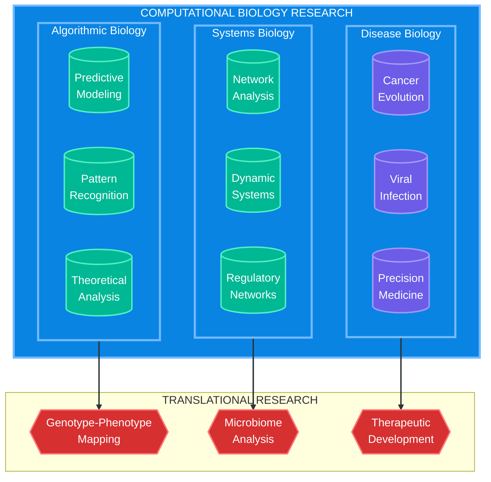
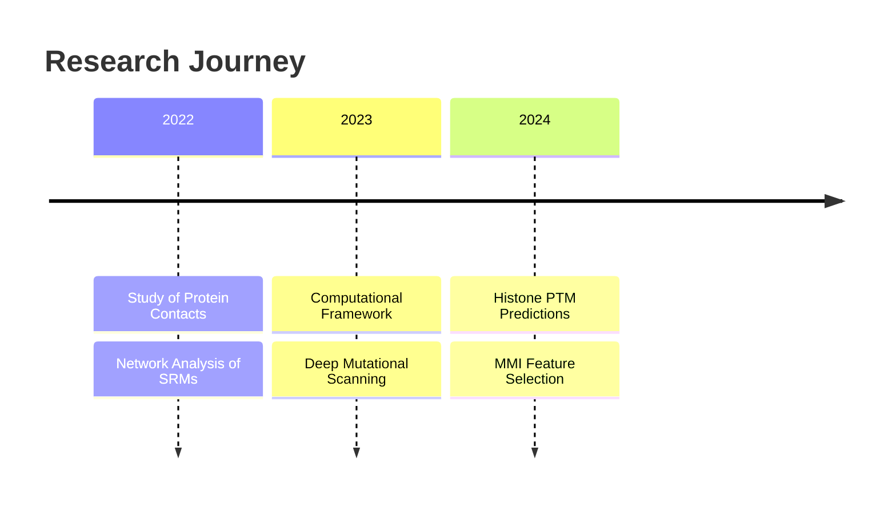
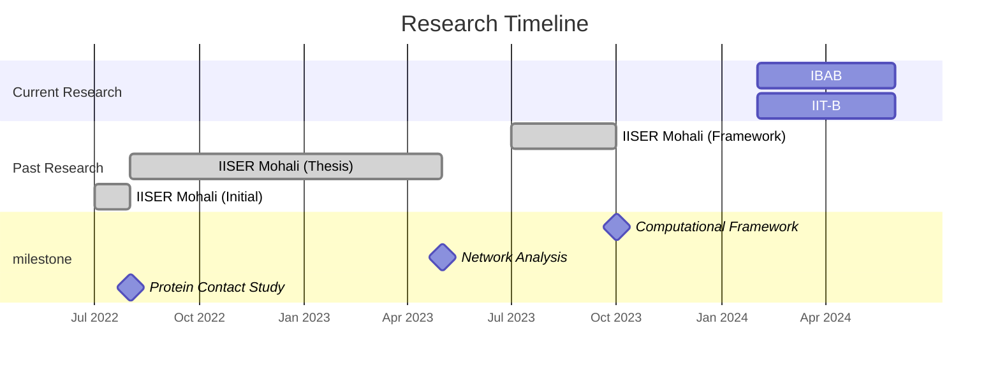

<div align="center">
  
  
  [](https://git.io/typing-svg)
</div>

### 🧬 Research Focus Areas


### 🔬 Core Competencies

<table>
  <tr>
    <td width="50%">
      <h4>Computational Expertise</h4>
      <ul>
        <li>Advanced Machine Learning Architectures</li>
        <li>High-Performance Computing</li>
        <li>Distributed Systems for Genomic Data</li>
      </ul>
    </td>
    <td width="50%">
      <h4>Biological Domain</h4>
      <ul>
        <li>Next-Generation Sequencing Analysis</li>
        <li>Structural Bioinformatics</li>
        <li>Systems Biology Modeling</li>
      </ul>
    </td>
  </tr>
</table>

### 📊 Research Analytics

<div align="center">
  
  
</div>

### 🧪 Research Pipeline

```python
class BiologicalResearch:
    current_projects = {
        "protein_structure": {
            "status": "Active",
            "technology": ["PyTorch", "AlphaFold2", "ESMFold"],
            "progress": 0.75
        },
        "genomic_analysis": {
            "status": "Ongoing",
            "technology": ["NextFlow", "GATK", "DeepVariant"],
            "progress": 0.82
        },
        "network_biology": {
            "status": "Planning",
            "technology": ["NetworkX", "Cytoscape", "R-igraph"],
            "progress": 0.35
        }
    }

    @staticmethod
    def get_research_focus():
        return ["Protein Structure Prediction", 
                "Genomic Data Analysis",
                "Biological Network Modeling"]
```

### 📚 Selected Publications & Preprints

| Year | Title | Category | Status |
|------|--------|----------|---------|
| 2024 | Deep Learning Approaches in Protein Structure Prediction | AI/ML | In Review |
| 2023 | Novel Methods for Genomic Data Analysis | Genomics | Published |
| 2023 | Systematic Analysis of Biological Networks | Systems Biology | Preprint |

### 🛠️ Technical Stack

<div align="center">

#### Core Technologies


#### Deep Learning & AI


#### Bioinformatics


</div>

### 📊 Research Impact & Metrics



### 🎯 Key Research Metrics

<table>
  <tr>
    <th>Research Area</th>
    <th>Impact Metrics</th>
    <th>Technologies</th>
  </tr>
  <tr>
    <td>Protein Structure Analysis</td>
    <td>
      • Analyzed 3,600+ protein pairs<br>
      • 2,004 Deep Mutational Scans<br>
      • Single Domain Protein Study
    </td>
    <td>Network Science, Graph Theory</td>
  </tr>
  <tr>
    <td>Histone PTM Research</td>
    <td>
      • MMI-based Feature Selection<br>
      • Graph Entropy Clustering<br>
      • Neural Network Models
    </td>
    <td>ML/DL, Graph Algorithms</td>
  </tr>
  <tr>
    <td>Web Framework</td>
    <td>
      • Protein Visualization Tool<br>
      • Contact Network Analysis<br>
      • UniProt Integration
    </td>
    <td>Web Development</td>
  </tr>
</table>

### 📈 Research Statistics

<div align="center">
  
  
  
</div>

### 🔬 Research Timeline



### 🎓 Research Collaborations

<div align="center">

| Institution | Collaborator | Research Focus |
|-------------|--------------|----------------|
| IBAB & IIT Bombay| Dr. Nithya Ramakrishnan &Dr. Sibi Raj B Pillai | Histone PTMs &MMI Analysis
| IISER Mohali & Kolkata | Dr. Shashi Bhushan Pandit & Prof. Somdatta Sinha| Protein Networks & Phenotypic Effects |

</div>

### 🤝 Research Collaboration

<div align="center">
  <a href="https://in.linkedin.com/in/dhanasekhar-v-k-975b31253">
    
  </a>
  <a href="mailto:dhanasekharvk@gmail.com">
    
  </a>
  <a href="https://github.com/dhana56">
    
  </a>
</div>

<div align="center">
  <h3>"Advancing the Frontiers of Computational Biology" 🧬</h3>
</div>
