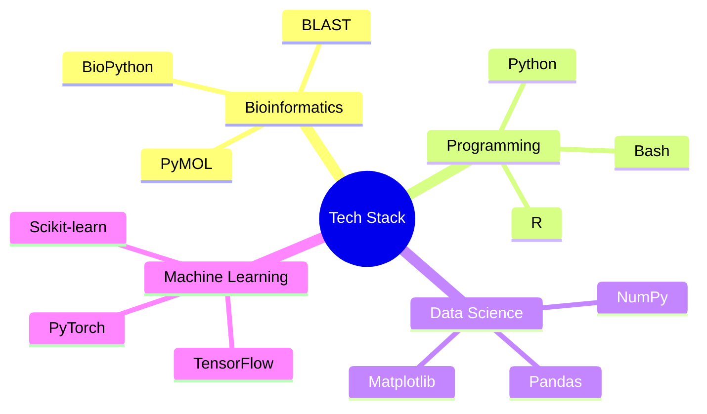

<div align="center">
  
  
  [](https://git.io/typing-svg)

  <a href="your-cv-link">
    
  </a>
  
  
</div>

<details open>
<summary><h2>🧬 About Me</h2></summary>

```python
class BioInformatician:
    def __init__(self):
        self.name = "Dhanasekhar V K"
        self.role = "Computational Biologist"
        self.location = "India 🇮🇳"
        self.skills = {
            "languages": ["Python", "R", "Bash"],
            "bio_tools": ["BioPython", "BLAST", "PyMOL"],
            "ml_tools": ["TensorFlow", "PyTorch", "Scikit-learn"],
            "databases": ["MongoDB", "MySQL"]
        }
        self.interests = ["Genomics", "ML in Biology", "NGS Analysis"]
    
    def get_bio(self):
        return "Decoding life's complexity through computation 🧬"

me = BioInformatician()
print(me.get_bio())
```
</details>

<details open>
<summary><h2>📊 GitHub Analytics</h2></summary>
<div align="center">
  
  

  
  
  
  
</div>
</details>

<details open>
<summary><h2>💻 Tech Stack</h2></summary>
<div align="center">



  
  
  <div>
    
    
    
  </div>
</div>
</details>

<details open>
<summary><h2>🔬 Current Research</h2></summary>

- 🧬 **Genomic Analysis**: NGS data processing & variant calling
- 🤖 **AI in Biology**: Deep learning for protein structure prediction
- 📊 **Data Analysis**: Biostatistics & computational modeling
- 🦠 **Systems Biology**: Biological network analysis
</details>

<div align="center">
  <h2>🤝 Connect</h2>
  <a href="https://linkedin.com/in/dhanasekhar-v-k-975b31253">
    
  </a>
  <a href="mailto:dhanasekharvk@gmail.com">
    
  </a>
  
  
  <h3>"Where Code Meets Biology" 🧬</h3>
</div>